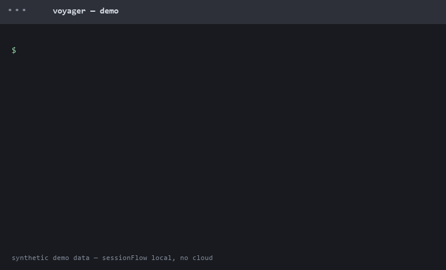
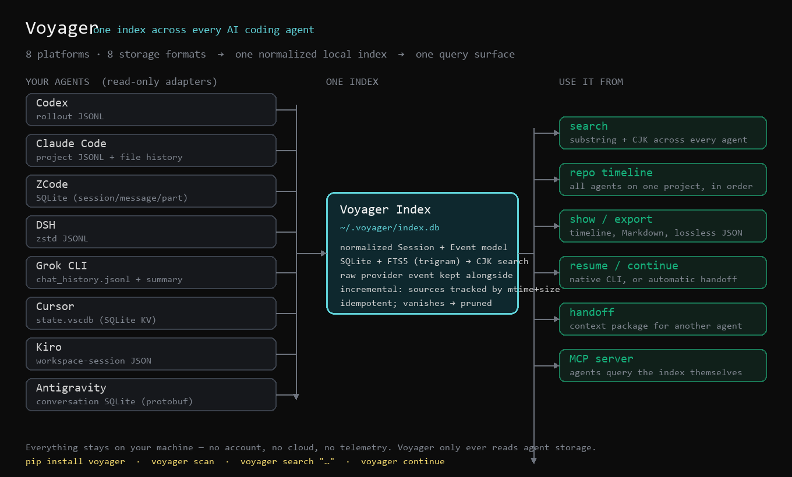
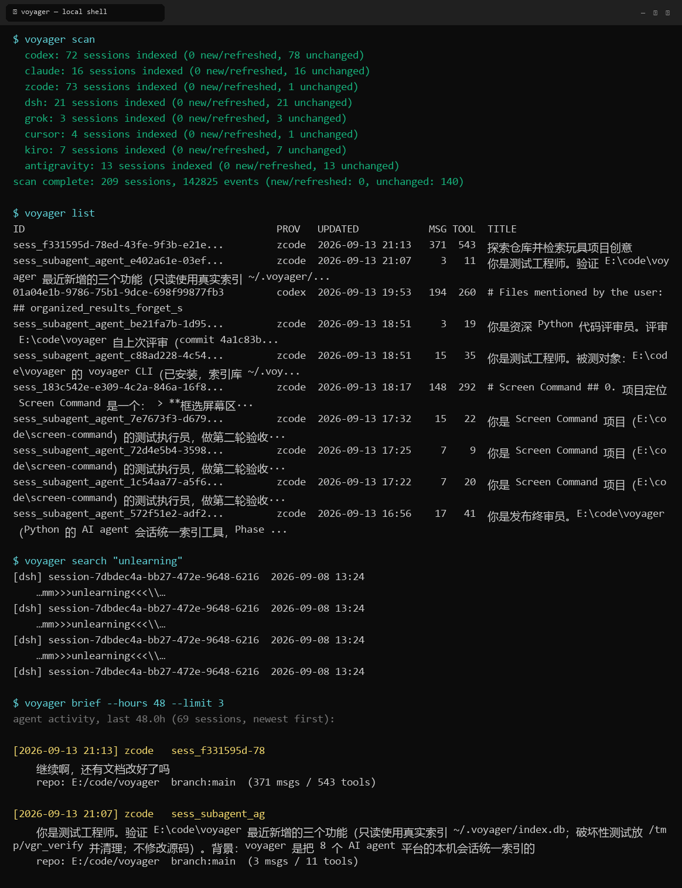
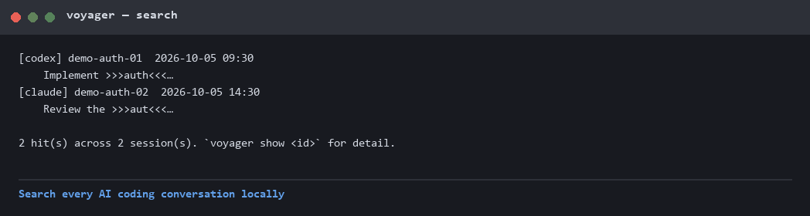
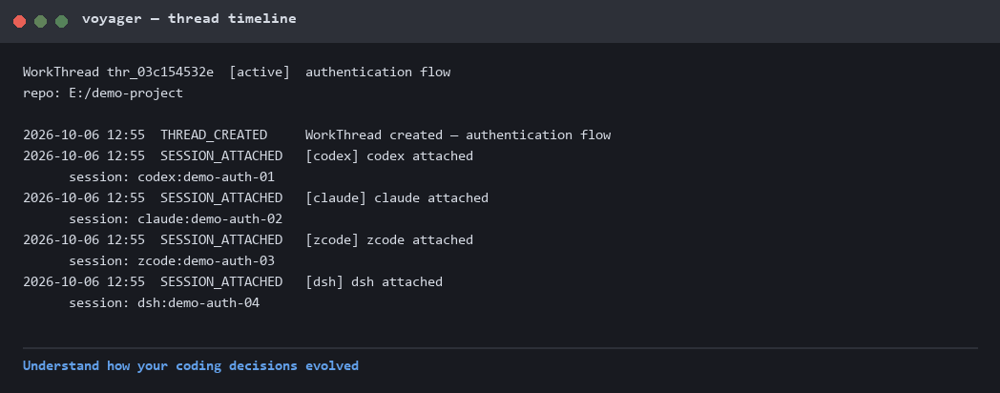
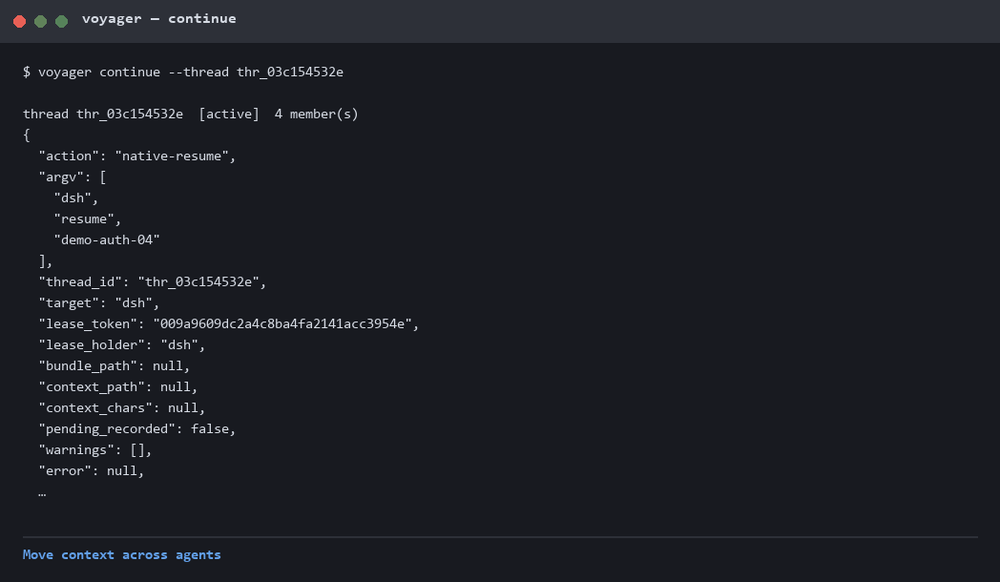

# sessionFlow 🧭

[](https://github.com/HarryHeYu/sessionFlow/actions/workflows/test.yml)
[](https://www.python.org/downloads/)
[](LICENSE)


**One searchable memory layer for every AI coding agent.**
(the CLI command is `voyager`; the GitHub project is sessionFlow)

Your AI coding history is fragmented:

- Codex sessions (rollout JSONL)
- Claude Code conversations (project JSONL)
- DSH runs (zstd JSONL)
- ZCode / Cursor / Kiro / Grok / Antigravity (SQLite, VSCDB, JSON...)

sessionFlow creates **one local index** out of all of them — pure local,
no accounts, no cloud, no telemetry.

**Search. Understand. Continue. Switch agents without losing context.**



Cross-agent continuity is built in: merge context across sessions and
continue in any agent (`voyager merge` / `switch` / `continue`) — see
[docs/ROADMAP.md](docs/ROADMAP.md) for the shipped scope and
[docs/POST-1.0.md](docs/POST-1.0.md) for what's next.

[中文说明](README.zh-CN.md)

## A day with sessionFlow

```
Morning    Codex implements the SQLite migration
Afternoon  Claude Code reviews the code
Evening    DSH keeps debugging the edge case

sessionFlow:
  find the previous reasoning   -> voyager search "sqlite migration"
  restore the full context      -> voyager continue <thread>
  switch agents mid-work        -> voyager handoff claude --from codex
```

Nothing is uploaded anywhere: sessionFlow reads the session files your
agents already wrote, normalizes them into one SQLite index you can search,
resume from, hand off to another agent, or query straight from inside an
agent over MCP / the DSH plugin.



Eight agents keep eight different formats; Voyager normalizes them into one
SQLite index you can search, resume from, hand off to another agent, or query
straight from inside an agent over MCP.



```
$ voyager list
ID                                    PROV   UPDATED            MSG TOOL  TITLE
a1b2c3d4-...                          zcode  2026-09-13 01:13   162  206  重构存储引擎的写入路径
9f8e7d6c-...                          codex  2026-07-06 22:52    76  168  修复多线程下载器的竞态条件
5e4d3c2b-...                          claude 2026-07-17 12:46    89   70  分析数据集结构并设计评测脚本
```

Use cases live in [docs/use-cases.md](docs/use-cases.md) — lost context,
agent switching, engineering memory.

## Why

Every agent keeps its own history in its own format: Codex writes rollout
JSONL, Claude Code writes project JSONL plus a file-version chain, ZCode
uses SQLite, DSH compresses JSONL with zstd. You work across all of them —
Voyager makes that history *one* thing you can query.

- **Cross-agent timeline per repo** — what did all your agents do to this
  project, and when?
- **Full-text search everywhere** — find the session where someone ran
  that one command or touched that one file (CJK substring search works).
- **Real exports** — human-readable Markdown, or lossless JSON with both
  the normalized and the raw events.
- **Resume where you left off** — Voyager knows each platform's resume
  command and runs it for you.

## Install

```sh
# isolated CLI install — no virtualenv juggling (recommended)
pipx install "voyager[all] @ git+https://github.com/HarryHeYu/sessionFlow.git"

# or with pip (user-level)
pip install "voyager[all] @ git+https://github.com/HarryHeYu/sessionFlow.git"

# once the release is on PyPI (tracked in CHANGELOG.md)
pipx install voyager
```

`[all]` = DSH support (`zstandard`) + MCP server (`mcp`). The two are
optional and only needed for those features:

```sh
pip install "voyager @ git+https://github.com/HarryHeYu/sessionFlow.git"          # core
pip install "voyager[dsh] @ git+https://github.com/HarryHeYu/sessionFlow.git"     # + DSH
pip install "voyager[mcp] @ git+https://github.com/HarryHeYu/sessionFlow.git"     # + MCP server
```

Working on Voyager itself:

```sh
git clone https://github.com/HarryHeYu/sessionFlow && cd sessionFlow
pip install -e ".[all,dev]"    # editable + extras + pytest
python -m pytest tests/ -q     # full dev env: ~970 passed
```

Python ≥ 3.10. Windows / macOS / Linux. If `voyager` is not on your PATH,
run it as `python -m voyager.cli`.

## Quick Start

### Fast Demo — no agents needed (2 minutes)

`voyager demo` seeds a small **synthetic** index — four agents working one
"authentication flow" thread across a working day. No real agent, no real
data, nothing to install beyond sessionFlow itself:

```sh
voyager demo
voyager search --db ~/.voyager/demo.db "authentication"   # hits 2 agents
voyager search --db ~/.voyager/demo.db "JWT refresh token"
voyager show --db ~/.voyager/demo.db codex:demo-auth-01   # compiled session
```

The demo index (`~/.voyager/demo.db`) is separate from your real one —
delete it whenever you like. What that looks like:







All screenshots are generated from the synthetic demo
(`scripts/make_screenshots.py`) — no real user data in this README.

### Real Usage — your own agents (5 minutes)

Once at least one of your agents has session history on this machine:

```sh
voyager scan                # discover + index every supported agent
voyager list                # all sessions, newest first
voyager list --repo myproj  # sessions for one repo
voyager show <id>           # full message / tool-call timeline
voyager search "tensorboard"
voyager repo E:/code/myproj # cross-agent timeline for a repository
```

`voyager scan` walks every supported agent's local storage and builds the
index at `~/.voyager/index.db`; it is incremental and only re-reads what
changed. To keep the index current with zero manual steps, run a watcher
in the background (OS autostart, or the provided `~/.voyager/watch.vbs`
in the Windows Startup folder):

```sh
voyager watch --interval 300    # re-scan every 5 minutes, forever
```
voyager export <id> --format md   # or --format json (includes raw events)
voyager resume <id>         # launches the native agent on that session
voyager handoff <id> --to codex   # context package for another agent
voyager continue            # one command to pick your latest work back up
voyager thread list         # WorkThreads: task-centric session groups
voyager switch codex        # switch the active thread to another agent
voyager skill install       # teach other agents about voyager
voyager brief               # 48h digest of what every agent is doing
voyager files <id>          # files the session touched
voyager diff <id>           # Claude sessions: rebuilt before/after diffs
voyager stats               # index statistics
```

**Cross-agent handoff** is **work continuation**, not session migration
(the other agent cannot inherit hidden tool state or cached reasoning).
`voyager handoff <id> --to codex` extracts the session into a Context
Package (goal, instructions, files touched, commands, errors, where the
work stopped) and shows the launch command; add `--launch` to start it.
The target is told to read the package file and continue — works for
`claude`, `codex` and `grok`; other targets get the file to paste.
Same-provider pickup still uses native resume (`codex resume`, …).

**One command to continue**: `voyager continue` picks your newest session
and does the right thing — native resume for codex/claude/dsh/grok,
automatic handoff package for the rest. `voyager continue --repo myproj
--launch` goes straight back into a specific project; multi-session
synthesis (`voyager merge A B C`) groups the work into a **WorkThread**
and cross-agent switch is one command (`voyager switch codex` — lease
aware, see [docs/ROADMAP.md](docs/ROADMAP.md)).

`switch`, `continue`, `handoff` and `merge` are four spellings of **one
engine** (`continuity.handoff_thread` — see
[docs/DECISIONS.md](docs/DECISIONS.md) D14), so they cannot drift apart. When
the work sits in a WorkThread, all four take the single-writer lease, prefer
the native resume, record the pending attach that lets the next `scan` adopt
the target agent's new session, and warn — never stash — on a dirty tree.
`handoff` is the export spelling: `--to` names the agent that will *read* the
package, so it always compiles one. `--steal` takes over a live lease
explicitly; without it a second agent is refused by name.

**Goal-conditioned & budgeted**: add `--goal "finish adapter tests"` to
rank the evidence, and `--budget compact|balanced|full|Nk` to cap the
bundle size (estimate printed). Without `--goal`/`--budget` the output is
unchanged.

**Transcript mode (opt-in, experimental)**: `voyager switch codex --mode
transcript` writes a NEW native session containing a flattened
user/assistant transcript (tools/state dropped) so the target resumes
natively. Only codex/grok pass the resume gate today (claude timed out,
dsh unverified) — the default remains the Continuation Bundle. This is
work continuation, not session teleportation: hidden tool state and
provider runtime state never move.

**Everyday flow** — `brief` to see what's moving, `export` to read one
session in full (a 2,915-message DSH session → a 20 MB Markdown file),
`continue` or `handoff` to pick it back up. Full recipes in
[docs/WORKFLOWS.md](docs/WORKFLOWS.md).

Session ids are matched by prefix; if a prefix is ambiguous Voyager lists
the candidates and exits. `resume` runs the native agent's own command
(e.g. `codex resume <id>`); providers without a CLI resume path say so
explicitly instead of pretending.

## Startup Continuity — product status

**Core functionality**: Complete and operational.  
**Runtime auto-trigger**: Claude Code, Grok and Codex have native `SessionStart` hooks, and Voyager registers them. Claude Code firing its hook is **live-verified as of 2026-09-24**, Grok as of 2026-09-25, and **Codex as of 2026-09-28**: a normally launched Codex session in the same repo received the `tiered-v1` context before its first turn and continued the current WorkThread on a bare `继续`.

The `startup_continuity()` function correctly discovers WorkThreads, auto-attaches sessions, and compiles continuation context. What varies per provider is whether a session start can reach that function *without the user doing anything*.

**Provider classification**:

Codex is now on the native-hook path: `voyager integrate install codex` writes
`~/.codex/hooks.json`, and the fail-open handler emits the shared
`hookSpecificOutput.additionalContext` envelope with `tiered-v1` context before
the first turn. Its handler, identity propagation, and idempotent lifecycle
are covered by integration tests, and a live provider firing is **verified**
(2026-09-28): hook delivery, native auto-attach, and zero-touch continuation.

**Codex zero-touch continuity — live-verified 2026-09-28**:

| Capability | Status |
|---|---|
| native SessionStart hook | PASS |
| tiered-v1 context delivery | PASS |
| zero-touch cross-agent continuity | PASS |
| native auto-attach | PASS |

Open Codex normally in the same repo and type nothing but `继续`: it continues
the current WorkThread without calling `voyager_startup`, `voyager_continue`,
or any retrieval command.

**Boundary**: this is **semantic continuity**, not native transcript
teleportation. The provider still starts a new native conversation; Voyager
supplies the goal, the recent real work and the repository state — not a replay
of the previous session's hidden tool state.

| Provider | Skill | MCP | Status                | What it means                          |
|----------|-------|-----|-----------------------|----------------------------------------|
| Claude   | Y     | R   | `H` — hook registered | Native `SessionStart` hook installed; the provider **has** been observed firing it live (2026-09-24). `H` is a static capability reading, not live evidence |
| Codex    | Y     | R   | `H` — hook registered | Native `SessionStart` hook installed; the provider **has** been observed firing it live (2026-09-28) and a bare `继续` continued the WorkThread with no Voyager command |
| Grok CLI | Y     | N   | `H` — hook registered | Native `SessionStart` hook installed; the provider **has** been observed firing it live (2026-09-25). `H` is a static capability reading, not live evidence |
| DSH      | Y     | N   | `N` — no mechanism    | Best effort                            |

> **Single source of truth.** The table below is published from
> `voyager/capability_matrix.py`, which is also what `voyager doctor` and
> `voyager integrate status --deep` read. Each cell is a *declared* capability
> capped by what this machine has actually observed, so the docs cannot claim a
> live verification the code never earned. Run `voyager doctor` to regenerate the
> machine's view of it.

### Search

```
voyager search <text> [--limit N] [--json]
    [--provider codex,claude]   [--repo SUBSTR]
    [--since 7d | 2026-09-30]   [--until ...]
    [--kind user,assistant,tool_call]   [--tool SUBSTR]   [--file SUBSTR]
    [--origin human,provider_bootstrap] [--human-only]
```

The text is always one quoted FTS5 phrase -- `pytest -q`, `a:b` and `"unbalanced`
are ordinary text to a human and operators to FTS5 -- so the query never has to be
escaped by hand. The filters are the structured half, and they only ever narrow
where to look: `--human-only` excludes turns a provider injected through the user
channel, `--since 7d` accepts relative days or a date, and combining them is a
conjunction. Chinese substring search works because the index is trigram-based.

### WorkThread commands

```
voyager thread list|show|create|attach        # the basics
voyager thread activity <thread> [--json]     # who contributed what
voyager thread summarize <thread> [--json]    # one brief across every agent
voyager thread checkpoint <create|list|show|update|export|restore>
voyager thread close|reopen|archive <thread>  # explicit lifecycle
voyager thread stale [--days N] [--json]      # active but idle
```

A brief is a derivation over the canonical WorkThread -- deterministic, offline,
and independent of any model: the authoritative fields come from the thread
itself, the recent turns are grouped per agent and read oldest-first, and open
items exist only because a checkpoint recorded them. `reopen` warns when it would
leave two active threads for one repository, because ambiguity is a choice the
user makes, never something a timestamp settles.

### Dashboard

```
voyager dashboard [--out PATH] [--repo R] [--json]
```

Renders **one self-contained HTML file** (default `~/.voyager/dashboard.html`):
projects, WorkThreads, the active thread and its agent members, recent activity
with a client-side filter, checkpoints, provider health and the open items. It is
an observation panel, not a chat client -- no server, no CDN, no network requests,
no JavaScript dependencies. Everything it shows comes from the same sources as
`voyager doctor` and `voyager thread summarize`, so the page cannot tell a
different story from the commands.

### Observability commands

```
voyager doctor [--json]              # is this installation healthy, and why not
voyager verify [provider] [--json]   # declared / observed / effective per provider
voyager integrate status --deep      # every capability dimension, with its evidence

voyager db check   [--json]          # read-only integrity diagnosis
voyager db backup  [--json]          # consistent snapshot via SQLite's backup API
voyager db repair  [--json]          # plan by default; --apply runs the safe steps
voyager db compact [--json]          # VACUUM (maintenance, deliberately not "repair")
```

`db repair` never runs `VACUUM` — that is `db compact`. `db repair` plans by default and
`--apply` is the authorisation; there is no confirmation bypass.

**Verification levels** — these are deliberately *not* the same claim:

| Level | Meaning |
|---|---|
| SUPPORTED | Voyager can read the provider's session data |
| CONFIGURED | the provider's native startup hook is registered on this machine |
| UNIT_VERIFIED | the handler and envelope are covered by tests, **and** a real payload was driven through it end to end |
| LIVE_VERIFIED | the provider itself was observed firing the hook |
| ZERO_TOUCH_LIVE_VERIFIED | that, **and** a bare `继续` continued the WorkThread with no Voyager command |

| Provider | Startup surface | Level |
|---|---|---|
| Claude Code | native `SessionStart` | **ZERO_TOUCH_LIVE_VERIFIED** (2026-09-24) |
| Grok CLI | native `SessionStart` | **ZERO_TOUCH_LIVE_VERIFIED** (2026-09-25) |
| Codex | native `SessionStart` (`~/.codex/hooks.json`) | **ZERO_TOUCH_LIVE_VERIFIED** (2026-09-28, session `01a0e7a2-6b1f-7011-ad65-103e17fb1094`: the tiered-v1 developer message arrived before the first `继续`, and that turn made zero `voyager_*` calls; the run's trace is in `~/.voyager/logs/codex-hooks.jsonl`) |
| ZCode | native hooks (`~/.zcode/cli/config.json`, `hooks.events.SessionStart`) | **UNIT_VERIFIED** — configured, and the handler was driven end to end with a real payload; a provider-fired run is still pending |
| Cursor | native hooks (`~/.cursor/hooks.json`, `sessionStart`) | **UNIT_VERIFIED** — same |
| Kiro | native hooks (`SessionStart` / `AgentSpawn`, `.kiro/hooks/*.json`) | **UNIT_VERIFIED** — handler written and driven end to end; hooks are project-scoped, so installing is a per-project choice |
| Antigravity | native hooks (`PreInvocation`, `~/.gemini/config/hooks.json`) | **UNIT_VERIFIED** — same, and injecting only on the first invocation |
| DSH | none found — profiles/plugins/ACP only | **SUPPORTED** — wrapper only |

A unit test is never reported as a live verification here: ZCode, Cursor, Kiro and
Antigravity are *configured* and their handlers are exercised against real
payloads, but until the provider has actually fired the hook on this machine they
stay at UNIT_VERIFIED.

Legend: **Y** = installed, **R** = registered, **N** = unsupported, **A** = available/manual setup needed.

Startup status: **`Y`** = zero-touch verified live, **`H`** = native hook registered, **`A`** = startup-assisted, **`N`** = no hook. The letter is derived from **static capability and configuration only**.

Live verification is now a separate, persisted thing: `voyager verify` reports, per provider, the *declared* state (what the code supports), the *observed* state (what this machine has actually seen, derived from an append-only `verification_events` table) and the *effective* state (the weaker of the two). Observation can only lower a claim, never raise it above what the code supports, and `voyager verify` is strictly read-only — it cannot manufacture the evidence it reports. Run `voyager doctor` for the whole picture. Both Claude Code's trigger (2026-09-24) and Grok's (2026-09-25) *have* been observed live, and both still report `H`. Run `voyager integrate status` for the configuration answer on your machine.

### How native hooks work here

Claude Code reads `SessionStart` hooks from `~/.claude/settings.json`. Codex reads them from `~/.codex/hooks.json`. Voyager writes the documented nested shape for each provider and preserves unrelated hooks:

```json
{
  "hooks": {
    "SessionStart": [
      {
        "matcher": "startup",
        "hooks": [
          {"type": "command", "command": "\"<abs python>\" \"<abs>/claude_session_start.py\"", "timeout": 120}
        ]
      }
    ]
  }
}
```

`voyager integrate install claude` writes this for you (it is additive — your own hooks are preserved, and the file is backed up first). The installed command uses absolute paths, so it does not depend on the interpreter being on `PATH`.

For Codex, `voyager integrate install codex` registers an absolute `SessionStart` command in `~/.codex/hooks.json`. Codex passes its native `session_id` and `cwd` on stdin; Voyager responds with `hookSpecificOutput.additionalContext` using the shared `tiered-v1` continuation format. The hook is fail-open and never blocks a Codex session if the index is unavailable.

**Three things are verified.** The handler is verified end-to-end: it emits a protocol-valid payload, caps the injected context at 9,000 UTF-16 code units, spills the full bundle to `~/.voyager/context/`, and exits 0. The *registration* is verified: `voyager integrate status` reads the file back. And the **provider firing the hook is verified too** (2026-09-24) — the manual run below recorded a `SessionStart` whose `session_id` belongs to Claude Code itself, not the verifier's synthetic one:

```sh
claude --debug hooks --init-only     # expect: Found 1 hook matchers in settings
```

That line was observed on 2026-09-24, and the real `session_id` it carried then completed the whole chain: transcript discovered → indexed → pending row resolved → session attached to WorkThread `thr_0854d50b88`, with no Voyager command. What is **still** unproven is that the model actually *read and used* the injected context, and no provider prints `Y` — the CLI letter comes from static configuration, not from this observation. See [docs/DOGFOOD.md](docs/DOGFOOD.md#live-verification-2026-09-24--done) for the evidence table.

### What works right now ✅

- `startup_continuity()` handles discovery, attach, staleness detection
- Auto-attach works when conditions are safe (exact repo match, single thread)
- Context compilation reuses existing ranker+budget+continuation pipeline
- A compiled context bundle is cached in the store and reused across session starts (5-minute TTL, invalidated by git changes or thread membership changes)
- Ambiguity protection: explicit error if multiple active threads
- Auto-registration creates config files for Codex/Claude (`voyager integrate install <provider>`), including the native Claude Code hook

### How to use today 🔧

Recommended workflows:

1. **Native hook (Claude Code)**: `voyager integrate install claude`, then restart Claude Code. No further action — if the hook fires, context is injected before your first turn.
2. **Explicit commands**: `voyager switch <agent>` or `voyager continue [id]`
3. **MCP-assisted**: in-agent tool call `voyager_startup(provider="codex", cwd="$PWD")`
4. **Skill guidance**: read `SKILL.md` in the agent's skill directory

**`A` (startup-assisted) means**: the runtime will not reach Voyager on its own, so you must invoke it via one of the workflows above. For Codex this no longer applies once `voyager integrate install codex` has registered the native `SessionStart` hook (live-verified 2026-09-28): the hook reaches Voyager before the first turn, so `voyager_startup` is not needed and should not be called — startup context is the hook's job, and the skill is retrieval-only.

```sh
voyager integrate install claude   # skill + MCP + native SessionStart hook
voyager integrate install codex    # skill + MCP (~/.codex/config.toml)
voyager integrate status           # per-provider truth, including whether the hook is registered
voyager integrate remove claude    # removes only Voyager's entries, leaves your hooks alone
```

See [docs/DOGFOOD.md](docs/DOGFOOD.md) for the detailed verification procedure.

## Integration — teach agents about Voyager

Install the Skill file into known agent directories:

```sh
voyager skill install      # installs SKILL.md at ~/.{agent}/skills/voyager/SKILL.md
```

The Skill instructs agents when to use Voyager commands and when NOT to (never export full sessions).

To register Voyager as an MCP server so agents can query it with native tools:

```sh
voyager integrate install codex    # skill + MCP (~/.codex/config.toml)
voyager integrate install claude   # skill + MCP + native SessionStart hook (~/.claude/settings.json)
voyager integrate status           # per-provider truth, incl. whether the hook is registered
voyager integrate remove <provider>  # undo every step (skill + mcp + bootstrap + hook)
```

These commands now **auto-create** config files if they don't exist - no manual setup needed for first-time installation. Re-running is idempotent, and `install` merges rather than overwrites: your own hooks and settings are preserved, and the file is backed up before it is rewritten.

For verification of actual zero-touch startup behavior, see [docs/DOGFOOD.md](docs/DOGFOOD.md) and [claude_continuity_verdict.md](claude_continuity_verdict.md).

## Supported platforms

| Platform | Source | Messages | Tool calls | Shell exit | File diffs | Tokens | Resume |
|---|---|---|---|---|---|---|---|
| Codex (CLI/VSCode/Desktop) | rollout JSONL | ✅ | ✅ | ✅ | ❌ | ✅ | ✅ `codex resume` |
| Claude Code | project JSONL + file-history | ✅ | ✅ | ✅ | ✅ version chain | ✅ | ✅ `claude --resume` |
| ZCode | SQLite (`~/.zcode/cli/db`) | ✅ | ✅ | ✅ | ⚠️ file events (edits stay in raw) | ✅ usage tables | ❌ desktop only |
| DSH | zstd JSONL (`~/.dsh/sessions`) | ✅ | ✅ | ❌ | ❌ | ❌ | ✅ `dsh --resume` |
| Grok CLI | `chat_history.jsonl` + `summary.json` | ✅ | ✅ | ❌ | ❌ | ❌ | ✅ `grok -r` |
| Cursor | `state.vscdb` (SQLite) | ✅ | ✅ | ❌ | ⚠️ in raw | ⚠️ | ❌ IDE only |
| Kiro IDE | workspace-session JSON | ✅ | ❌ not persisted | ❌ | ❌ | ❌ | ❌ IDE only |
| Antigravity | conversation SQLite (protobuf) | ⚠️ heuristic | ⚠️ heuristic | ⚠️ text | ⚠️ snapshots on disk | ❌ | ❌ IDE only |

Cursor and Antigravity adapters are marked experimental: Cursor reads its
key-value store read-only and Antigravity decodes protobuf blobs
heuristically (no public schema). Full per-field availability matrix and
data-source paths for every tool are in [docs/RECON.md](docs/RECON.md).

## DeepSeek Harness integration

DeepSeek Harness integration: <https://github.com/HarryHeYu/dsh-sessionflow>

[`dsh-sessionflow`](https://github.com/HarryHeYu/dsh-sessionflow) is a thin DSH
plugin that exposes search, current work, continuation and merge as six
`sessionflow_*` tools, so a DSH agent can pick up work from Codex, Claude Code,
Grok and the rest without leaving the harness.

It is a *client* of this repo, not a second implementation: the core stays the
single source of truth, and the plugin talks to it over the stable JSON surface
(`voyager integration-info --json`, `voyager api`, `voyager merge --json`).

## Tests & CI

Adapters are the part of Voyager that breaks when a vendor ships a storage
change, so every platform has a regression test against a **synthetic**
fixture — no real session data, no agent installation needed:

```
tests/
├── fixtures/          # codex/claude/dsh/grok/kiro JSON+JSONL, zcode/cursor/antigravity SQL seeds
├── conftest.py        # builds tmp trees (incl. zstd + SQLite) and repoints adapters at them
├── test_codex.py  test_claude.py  test_zcode.py  test_dsh.py  test_grok.py
├── test_cursor.py  test_kiro.py  test_antigravity.py  test_adapters.py
├── test_store.py  test_export.py  test_handoff.py  test_cli.py  test_mcp.py
├── test_claude_session_start_hook.py   # the SessionStart entrypoint: protocol, size cap, spill, logging
├── test_codex_session_start.py         # Codex envelope, rollout-authoritative cwd
├── test_zcode_session_start.py         # ZCode envelope, camelCase payload aliases
├── test_cursor_session_start.py        # Cursor top-level additional_context, workspace_roots
├── test_kiro_antigravity_session_start.py  # Kiro raw stdout, Antigravity injectSteps gating
├── test_hook_payload.py                # the shared UTF-16 cap, both-ends cut, spill
├── test_provenance.py                  # origin classification and the NULL sentinel
├── test_l1_bands.py                    # STRONG/WEAK/UNKNOWN/BOOTSTRAP_ONLY and the scheduler
└── test_context_cache.py               # the persisted context cache, incl. hostile input
```

```sh
python -m pytest tests/ -q                # full dev env: 754 collected, 736 passed, 18 skipped — adapters, store, continuity, budget, leases, switch, skill, API, MCP, integration, provider hooks
python scripts/run_tests_core_only.py     # core-only simulated: a subset that skips the DB-backed suites
```

The two environments skip for different reasons, and the two numbers are not
interchangeable. With the full dev extras the only 2 skips are
**data-dependent**: `tests/test_unicode_preservation.py` reads the default local
index and skips when it holds no Chinese-titled session (`:33`) or no sessions
at all (`:103`). The core-only run adds 16 **dependency-gated** skips — `mcp`,
`zstandard` and `PIL` are absent, so `test_continuity_tools.py`, `test_mcp.py`,
`test_diagram.py` and `test_dsh.py` skip. Neither class is a platform gate.

CI ([.github/workflows/test.yml](.github/workflows/test.yml)) runs the suite
on Python 3.10–3.13 (Linux) and 3.10/3.13 (Windows — the adapters deal with
`%APPDATA%`, drive letters and backslashes), plus a core-only job proving the
CLI works with zero optional dependencies. The store tests cover the
"don't wreck my thousands of sessions" contract: repeated scans never
duplicate, changed sources are re-parsed, vanished sources are pruned.

## Design

Provider files are read-only. Adapters translate each platform's events into
one normalized model (`Session` / `Event`) while keeping the raw provider
event alongside — nothing is lost, giant blobs are truncated with a pointer
back to the source. Everything lands in a local SQLite index with FTS5
(trigram, so CJK substring search works). Scans are idempotent: sources are
tracked by `(mtime, size)` and re-parsed only when they change; sessions
whose source files vanish are pruned.

Details in [docs/architecture.md](docs/architecture.md),
[docs/DECISIONS.md](docs/DECISIONS.md), [docs/API.md](docs/API.md) and
[docs/FAQ.md](docs/FAQ.md) and everyday recipes in
[docs/WORKFLOWS.md](docs/WORKFLOWS.md).

## What's next

The Continuity Engine core is complete (see
[docs/ROADMAP.md](docs/ROADMAP.md) for the full close-out). The
post-1.0 backlog — VS Code Context Composer UI, auto-clustering
research, Claude/DSH transcript gates, scoped scan, fs-event watcher,
PyPI/packaging polish — lives in [docs/POST-1.0.md](docs/POST-1.0.md).

Phased plan, CLI sketches, and the issue list:
[docs/ROADMAP.md](docs/ROADMAP.md) · [中文](docs/ROADMAP.zh-CN.md).

## License

MIT — see [LICENSE](LICENSE).
