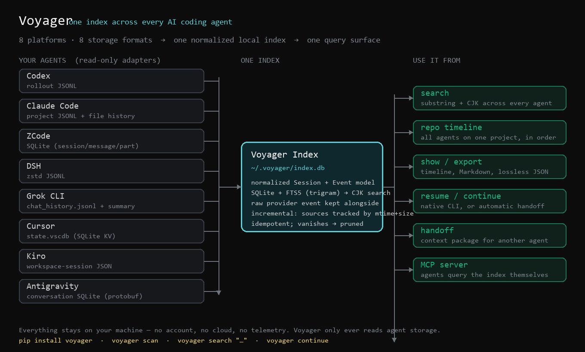
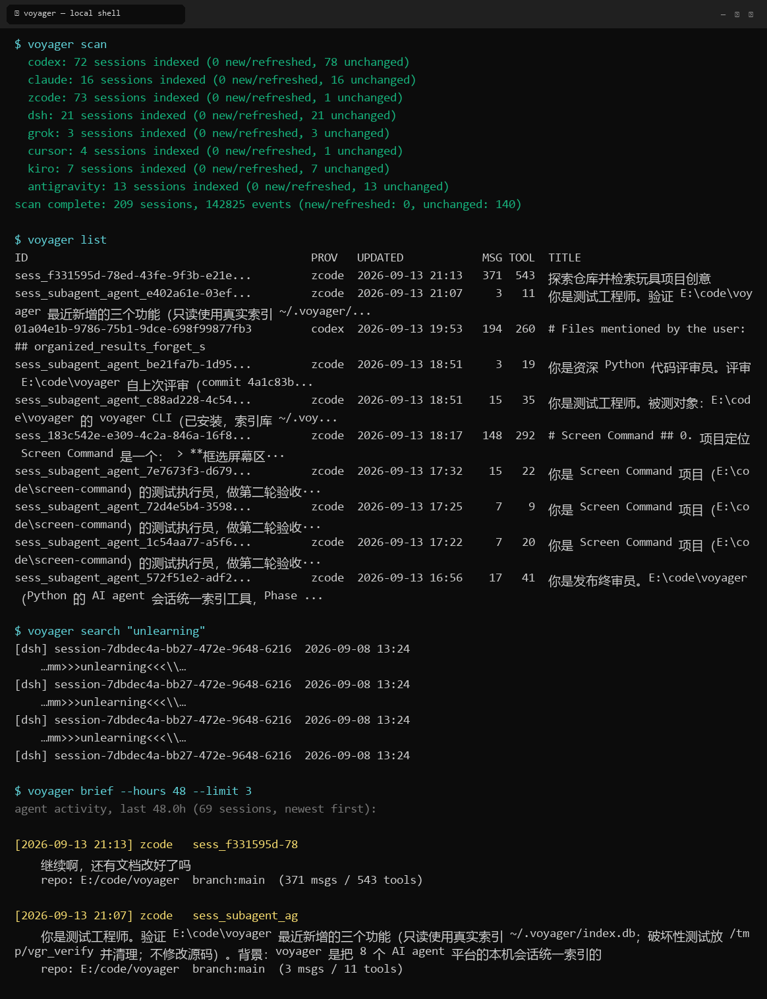

# Voyager 🧭

[](https://github.com/HarryHeYu/voyager/actions/workflows/test.yml)
[](https://www.python.org/downloads/)
[](LICENSE)


**把你机器上所有 AI 编码 Agent 的会话历史，变成一份可查询的索引。**

跨 Agent 接续层已内置：跨会话合并上下文，在任意 Agent 里接着干（`voyager merge` / `switch` / `continue`）——已交付范围见 [docs/ROADMAP.zh-CN.md](docs/ROADMAP.zh-CN.md)，后续计划见 [docs/POST-1.0.md](docs/POST-1.0.md)。

[English](README.md)

Voyager 读取各 Agent 已经写在本机的会话数据——Codex、Claude Code、ZCode、
DSH（DeepSeek Harness）等——整合成一份统一的历史库：可浏览、可搜索、可导出、
可一键恢复原 Agent 继续对话。纯本地运行，无账号、无云端、无遥测。



8 家 Agent 各写各的格式，Voyager 把它们归一化成一份 SQLite 索引：可以搜、
可以续、可以交接给另一个 Agent，也可以让 Agent 自己通过 MCP 直接查。



```
$ voyager list
ID                                    PROV   UPDATED            MSG TOOL  TITLE
a1b2c3d4-...                          zcode  2026-09-13 01:13   162  206  重构存储引擎的写入路径
9f8e7d6c-...                          codex  2026-07-06 22:52    76  168  修复多线程下载器的竞态条件
5e4d3c2b-...                          claude 2026-07-17 12:46    89   70  分析数据集结构并设计评测脚本
```

## 为什么需要它

每家 Agent 都用自己的格式存历史：Codex 写 rollout JSONL，Claude Code 写
project JSONL 外加一套文件版本链，ZCode 用 SQLite，DSH 用 zstd 压缩的
JSONL。你每天都在跨这些工具干活——Voyager 把这些历史变成**一个**可以查询的东西。

- **按 repo 汇总跨 Agent 时间线**——这个项目上所有 Agent 都干了什么、什么时候干的？
- **全库全文搜索**——找到"那条命令是哪个会话跑的"、"那个文件被谁改过"
  （中文子串搜索可用）。
- **真正的导出**——人类可读的 Markdown，或同时包含归一化事件与原始事件的 JSON。
- **一键恢复**——Voyager 知道每家平台的恢复命令，直接帮你调起来。

## 安装

```sh
# 用 pipx 装成独立 CLI（推荐，不用折腾虚拟环境）
pipx install "voyager[all] @ git+https://github.com/HarryHeYu/voyager.git"

# 或者用 pip 装到用户目录
pip install "voyager[all] @ git+https://github.com/HarryHeYu/voyager.git"

# 等 PyPI 发布后可简化为（进度见 CHANGELOG.md）
pipx install voyager
```

`[all]` = DSH 支持（`zstandard`）+ MCP server（`mcp`），两者都是可选能力：

```sh
pip install "voyager @ git+https://github.com/HarryHeYu/voyager.git"          # 核心
pip install "voyager[dsh] @ git+https://github.com/HarryHeYu/voyager.git"     # + DSH
pip install "voyager[mcp] @ git+https://github.com/HarryHeYu/voyager.git"     # + MCP server
```

想改 Voyager 本身：

```sh
git clone https://github.com/HarryHeYu/voyager && cd voyager
pip install -e ".[all,dev]"    # 可编辑安装 + 可选依赖 + pytest
python -m pytest tests/ -q     # 357 collected：339 passed / 18 skipped（全合成 fixture，不碰你的真实会话）
```

要求 Python ≥ 3.10，Windows / macOS / Linux 均可。如果 `voyager` 不在 PATH 里，
用 `python -m voyager.cli` 运行。

## 使用

第一次使用：`voyager scan` 会遍历所有支持的 Agent 的本地存储，在
`~/.voyager/index.db` 建立索引。之后想收录新会话就再跑一次 `scan`——
它是增量的，只重新读取有变化的部分。想让同步完全自动，可以常驻一个
watcher（或挂到计划任务里）：

```sh
voyager watch --interval 300    # 每 5 分钟自动重扫，常驻运行
```

把这条命令放进系统自启（Windows 下可直接把 `~/.voyager/watch.vbs` 放进
启动文件夹），索引就会零人工保持最新。

```sh
voyager scan                # 发现并索引所有支持的 Agent 会话
voyager list                # 全部会话，按更新时间排序
voyager list --repo myproj  # 某个 repo 的会话
voyager show <id>           # 完整时间线：消息 / reasoning / 工具调用 / 退出码
voyager search "tensorboard"
voyager repo E:/code/myproj # 一个 repo 的跨 Agent 时间线
voyager export <id> --format md   # 或 --format json（含原始事件）
voyager resume <id>         # 调起原 Agent 恢复该会话
voyager handoff <id> --to codex   # 生成给另一个 agent 的上下文包
voyager continue            # 一条命令接着上次干（原生恢复或自动接力）
voyager thread list         # WorkThread：以任务为中心的会话组
voyager switch codex        # 把当前 thread 切到另一个 agent
voyager skill install       # 教其他 agent 认识 voyager
voyager brief               # 最近 48h 所有 agent 在忙什么的摘要
voyager files <id>          # 该会话碰过哪些文件
voyager diff <id>           # Claude 会话：从版本链重建前后 diff
voyager stats               # 索引统计
```

**跨 Agent 接力**是**工作接续**，不是 Session 搬迁（对方拿不到隐藏的
tool state 或 cached reasoning）。`voyager handoff <id> --to codex` 会把
会话提炼成上下文包（目标、指令、碰过的文件、命令、报错、工作停在哪）并给出
启动命令；加 `--launch` 立即启动。目标 agent 被要求读这个文件接着干——
`claude`、`codex`、`grok` 可直接拉起；其他目标给出文件手动粘贴。
同一平台的续聊仍然走原生 resume（`codex resume` 等）。

**一条命令继续**：`voyager continue` 自动挑你最新的会话并做对的事——
codex/claude/dsh/grok 走原生恢复，其余自动生成接力包。`voyager continue
--repo myproj --launch` 直接回到某个项目的现场。多会话合并已经有了
（`voyager merge A B C` 会把工作聚合成 **WorkThread**）；跨 agent 切换是
一条命令（`voyager switch codex`——租约感知）。`--goal` 按目标给证据排序，
`--budget` 限制上下文包大小；`--mode transcript` 为选择性实验功能
（仅 codex/grok），默认仍是 Continuation Bundle。这是**工作接续**，
不是把 Session 原样搬过去——见
[docs/ROADMAP.zh-CN.md](docs/ROADMAP.zh-CN.md)。

**日常套路**——`brief` 看全局动态，`export` 完整细读某个会话（实测把
2915 条消息的 DSH 会话导成 20MB Markdown），`continue` / `handoff` 接着干。
完整配方见 [docs/WORKFLOWS.md](docs/WORKFLOWS.md)。

会话 ID 支持前缀匹配；前缀有歧义时会列出候选并退出，不会猜。

## 自动接续层（Zero-Touch Startup Continuity）

Voyager 在同一个仓库里切换 Agent 时会自动接续工作：

1. **索引已同步**（增量扫描，实时更新）
2. **当前仓库的 active WorkThread 被发现**  
3. **你的会话被安全地自动挂接到现有 WorkThread**
4. **Continuation bundle 已编译**（有 `--goal` 则条件压缩，有 `--budget` 则打包到预算内）
5. **上下文被立即加载** —— 不需要重新解释你正在做什么

**产品状态**：

**核心功能**：完整可用。  
**运行时自动触发**：Claude Code 有原生 `SessionStart` hook，Voyager 会注册它。但 Claude Code 是否真的会触发，**尚未在真机上验证过**。

`startup_continuity()` 能正确发现 WorkThread、自动挂接会话、编译接续上下文。各家 provider 的差别在于：会话启动时能不能**在你什么都不做**的前提下走到这个函数。

**Provider classification**：

| Provider | Skill | MCP | Status                | 含义                                   |
|----------|-------|-----|-----------------------|----------------------------------------|
| Claude   | Y     | R   | `H` — hook 已注册      | 已安装原生 `SessionStart` hook；触发尚未在真机观察到 |
| Codex    | Y     | R   | `A` — 启动辅助         | 无原生 hook，需要显式调用               |
| Grok CLI | Y     | N   | `N` — 无机制           | Best effort                            |
| DSH      | Y     | N   | `N` — 无机制           | Best effort                            |

Legend：**Y** = ready/installed，**R** = ready/auto-configured，**N** = unsupported。

启动状态：**`Y`** = 零触达已真机验证，**`H`** = 原生 hook 已注册但**实时触发尚未验证**，**`A`** = 启动辅助，**`N`** = 无 hook。只有 `Y` 才宣称 provider 会自己触发；目前没有任何 provider 是 `Y`。在你机器上的实际情况，跑 `voyager integrate status` 即可。

### Claude Code hook 在这里怎么工作

Claude Code 从 `~/.claude/settings.json` 读取 `SessionStart` hook。Voyager 写的是官方文档里的结构：

```json
{
  "hooks": {
    "SessionStart": [
      {
        "matcher": "startup",
        "hooks": [
          {"type": "command", "command": "\"<绝对路径 python>\" \"<绝对路径>/claude_session_start.py\"", "timeout": 120}
        ]
      }
    ]
  }
}
```

`voyager integrate install claude` 会自动写好它（叠加式写入：你自己的 hook 会被保留，且写前会备份原文件）。安装的命令用绝对路径，因此不依赖解释器是否在 `PATH` 里。

**两件事已验证，一件事没有。** Handler 已验证：它输出协议合法的 payload，把注入的上下文限制在 9000 个 UTF-16 码元以内，完整 bundle 落到 `~/.voyager/context/`，并以 0 退出。**注册**已验证：`voyager integrate status` 会把文件读回来核对。**没有**验证的是 Claude Code 自己会不会调用这个 hook —— 这需要手动跑一次：

```sh
claude --debug hooks --init-only     # 期望看到：Found 1 hook matchers in settings
```

在看到那一行之前，触发都应视为未证实。完整证据链见 [claude_continuity_verdict.md](claude_continuity_verdict.md)。

**推荐 workflow**（按自动化程度排序）：

1. **原生 hook（Claude Code）**：`voyager integrate install claude`，然后重启 Claude Code。之后不需要任何操作 —— 如果 hook 触发，上下文会在你第一轮输入之前注入。
2. **Explicit commands**：`voyager switch <agent>` 或 `voyager continue [id]`
3. **MCP-assisted**：在 agent 内调用工具 `voyager_startup(provider="codex", cwd="$PWD")`
4. **Skill guidance**：读该 agent skill 目录下的 `SKILL.md`

### `A`（启动辅助）的含义

Provider 支持 Voyager 集成（Skill 已装、MCP 配置可用），但**运行时不会自己走到 Voyager**。Codex 在会话启动时不会自动调用 `voyager_startup` —— 必须用上面任一 workflow 显式触发。MCP 注册是全自动的，启动调用不是。

```sh
voyager integrate install claude   # skill + MCP + 原生 SessionStart hook
voyager integrate install codex    # skill + MCP（~/.codex/config.toml）
voyager integrate status           # 逐 provider 的真实状态，含 hook 是否已注册
voyager integrate remove claude    # 只删 Voyager 自己的条目，你的 hook 原样保留
```

运行 `voyager integrate status` 检查本地安装状态。See [docs/DOGFOOD.md](docs/DOGFOOD.md) for detailed verification procedure.

## MCP —— 在你的 Agent 里原生调用

Voyager 自带 MCP server，让 agent 用原生工具查询统一索引，而不需要跑命令：

```sh
pip install -e ".[mcp]"     # 或：pip install "voyager[mcp]"
voyager-mcp                 # 等价于 python -m voyager.mcp_server
```

```json
{ "mcpServers": { "voyager": { "command": "python", "args": ["-m", "voyager.mcp_server"] } } }
```

提供工具：`voyager_brief`（所有 agent 最近在忙什么）、`voyager_search`、
`voyager_list`、`voyager_show`、`voyager_handoff` / `voyager_merge`（为另一个
agent 生成上下文包/接续包）、`voyager_thread_list/show/attach/close`
（WorkThread 管理）。`voyager_current`（自动发现 WorkThread）、
`voyager_context` / `continue` / `switch`（显式跨 Agent 切换）。
`voyager_startup`（零-touch 启动，自动发现 + 自动挂接 + 加载上下文）。
已测试的宿主：Codex（`config.toml`）、Claude Code（`claude mcp add`）、
Cursor（`mcp.json`）。没装 `mcp` 时，服务会打印上面那行安装命令而不是抛一个
光秃秃的 `ModuleNotFoundError`；CLI 其余功能完全不需要它。

## 支持的平台

| 平台 | 数据源 | 消息 | 工具调用 | Shell 退出码 | 文件 diff | Token | 恢复 |
|---|---|---|---|---|---|---|---|
| Codex（CLI/VSCode/桌面版） | rollout JSONL | ✅ | ✅ | ✅ | ❌ | ✅ | ✅ `codex resume` |
| Claude Code | project JSONL + file-history | ✅ | ✅ | ✅ | ✅ 版本链 | ✅ | ✅ `claude --resume` |
| ZCode | SQLite（`~/.zcode/cli/db`） | ✅ | ✅ | ✅ | ⚠️ 文件事件（编辑内容在 raw 里） | ✅ 用量表 | ❌ 仅桌面端 |
| DSH | zstd JSONL（`~/.dsh/sessions`） | ✅ | ✅ | ❌ | ❌ | ❌ | ✅ `dsh --resume` |
| Grok CLI | `chat_history.jsonl` + `summary.json` | ✅ | ✅ | ❌ | ❌ | ❌ | ✅ `grok -r` |
| Cursor | `state.vscdb`（SQLite） | ✅ | ✅ | ❌ | ⚠️ 在 raw 里 | ⚠️ | ❌ 仅 IDE |
| Kiro IDE | workspace-session JSON | ✅ | ❌ 未持久化 | ❌ | ❌ | ❌ | ❌ 仅 IDE |
| Antigravity | 会话 SQLite（protobuf） | ⚠️ 启发式 | ⚠️ 启发式 | ⚠️ 文本 | ⚠️ 快照在磁盘 | ❌ | ❌ 仅 IDE |

Cursor 与 Antigravity 适配器标记为实验性：Cursor 只读解析它的 KV 存储，
Antigravity 用启发式方式解码 protobuf blob（无公开 schema）。
每个工具的逐字段可得性矩阵和数据源路径见 [docs/RECON.md](docs/RECON.md)。

## 测试与 CI

适配器是最容易坏的地方——各家 Agent 一改本地存储格式就可能解析失败——所以每个
平台都有针对**合成 fixture** 的回归测试：不涉及任何真实会话数据，也不需要装
任何 Agent：

```
tests/
├── fixtures/          # codex/claude/dsh/grok/kiro 的 JSON+JSONL、zcode/cursor/antigravity 的 SQL 种子
├── conftest.py        # 在临时目录里生成真实结构（含 zstd / SQLite）并把适配器指过去
├── test_codex.py  test_claude.py  test_zcode.py  test_dsh.py  test_grok.py
├── test_cursor.py  test_kiro.py  test_antigravity.py  test_adapters.py
└── test_store.py  test_export.py  test_handoff.py  test_cli.py  test_mcp.py
```

```sh
python -m pytest tests/ -q                # 357 collected：339 passed / 18 skipped —— 适配器 / 接续引擎 / 预算 / 租约 / switch / Skill / API / MCP
python scripts/run_tests_core_only.py     # 模拟"只装核心依赖"，可选依赖相关测试自动跳过
```

CI（[.github/workflows/test.yml](.github/workflows/test.yml)）在 Python 3.10–3.13
（Linux）与 3.10/3.13（Windows，适配器要处理 `%APPDATA%`、盘符和反斜杠）上跑全量
测试，另有一个"零可选依赖"任务证明核心 CLI 不依赖任何额外包。索引层的测试专门守住
"不会把我的几千条会话索引坏"这条底线：重复扫描不重复、变更的 source 才重解析、
消失的 source 才清理。

## 设计一句话

Provider 的文件只读不改。Adapter 把各平台事件翻译成统一的 `Session` / `Event`
模型，同时**保留原始事件**——大字段按层级截断并带回源指针，信息不丢。全部落进
本地 SQLite + FTS5（trigram 分词，中文子串可搜）。扫描幂等：source 按
`(mtime, size)` 跟踪，变了才重解析；源文件消失的会话自动清理。

细节见 [docs/ARCHITECTURE.md](docs/ARCHITECTURE.md) 和
[docs/DECISIONS.md](docs/DECISIONS.md)。

## 下一步

索引是地基。真正的跳跃是 **Continuity Engine**：把多个 Agent、多个会话
编译成*下一个* Agent 真正需要的上下文，然后接着干。UI（VS Code 侧边栏 /
Context Composer）排在这条 pipeline 之后。

分阶段计划、CLI 草稿和 issue 列表：
[docs/ROADMAP.zh-CN.md](docs/ROADMAP.zh-CN.md) · [English](docs/ROADMAP.md)。

## License

MIT — 见 [LICENSE](LICENSE)。
